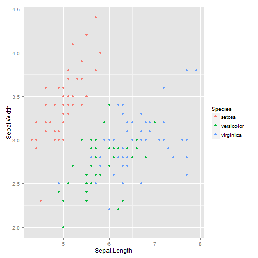

Shiny Iris Presentation
========================================================
How to use the Iris Shiny App

author: RogierGit  
date: 22-feb-2015

Introduction
========================================================


- This shiny app will allow you to explore the iris dataset from R.
- The dataset contains 4 iris characteristics that can be used to specify a species.
- In this app you can select a variable for X-axis and for the Y-axis.
- The plot will then show these 2 variables and colorcode the species.

The Iris App can be run here: <https://rogier.shinyapps.io/shiny/>

About the dataset
========================================================

Using the Iris App you're able to explore the iris variables that can be used to classify a species.


```r
#the 4 variables and outcome species
names(iris)
```

```
[1] "Sepal.Length" "Sepal.Width"  "Petal.Length" "Petal.Width" 
[5] "Species"     
```

Sample data
========================================================
Here's an example of the raw dataset

```r
head(iris,3)
```

```
  Sepal.Length Sepal.Width Petal.Length Petal.Width Species
1          5.1         3.5          1.4         0.2  setosa
2          4.9         3.0          1.4         0.2  setosa
3          4.7         3.2          1.3         0.2  setosa
```

Iris plots
========================================================

The app will plot a selected variable for the X-axis and Y-axis and color by species. Example:

 


